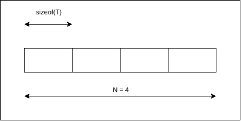
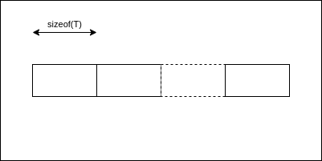
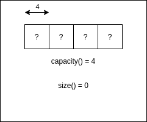
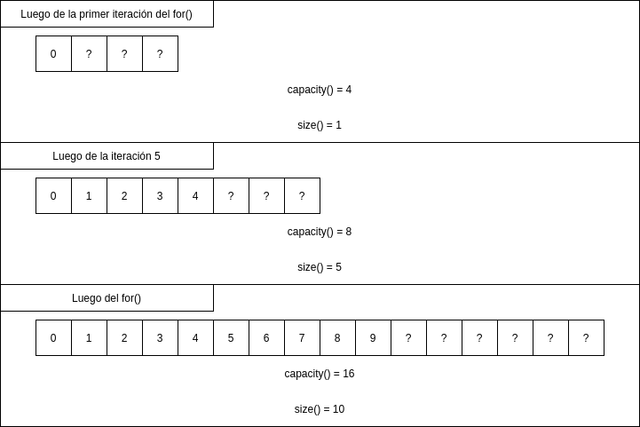

# Contenedores e iteradores

Ejemplos sobre los distintos tipos de contenedores que propone la STL (Standard template library) junto con el concepto de iteradores en C++.

## Array

```c++
template <class T, size_t N> class array;
```



Los arrays son contenedores de tamaño fijo, definido por su segundo parámetro de template. El tipo de dato que alojará el *array* está definido por el primero parámetro de template. Es el contenedor más básico de todos, sólo destinado a buffers de tamaño conocido en tiempo de compilación pero con una filosofía orientada a objetos, a diferencia del array tradicional de C.

Cabe destacar que el alojamiento en memoria es **contiguo**, es decir, cada elemento se encuentra en una posición de memoria adyacente al próximo.

## Vector

```c++
template <class T, class Alloc = allocator<T>> class vector;
```



Los vectores son contenedores de tamaño variable. El tipo de dato que alojará el *vector* está definido por su primer parámetro de template. A medida que se vayan insertando elementos en el mismo, el contenedor automáticamente alojará la memoria necesaria. La cantidad de memoria nueva que alojará depende de la implementación de la librería, pero suele ser un crecimiento exponencial. Comparado con los *arrays*, los *vectores* consumen un poco más de memoria, a expensas de tener un crecimiento dinámico.

Los *vectores* solo pueden expandirse agregando elementos al final del mismo. Al igual que con los *arrays*, el alojamiento en memoria de los datos es **contiguo**. Cada vez que el *vector* tiene que reservar memoria nueva para expandir su capacidad tiene que copiar los datos que contenía hasta el momento, lo cual es poco performante para datos que crecen a un ritmo muy frecuente. A continuación se diagraman distintos estados en memoria de un *vector* para distintas situaciones:

```c++
// Creación de un vector reservando previamente cuatro lugares en el mismo
std::vector<int> v(4);
```



```c++
// Insertado de diez elementos en el vector
for (int i = 0; i < 10; i++) {
  v.push_back(i);
}
```



## Cola de dos extremos

```c++
template <class T, class Alloc = allocator<T>> class deque;
```

Las colas de dos extremos (de ahora en adelante, *cola*) son contenedores que como los *vectores* son de tamaño variable. El tipo de dato que alojará la *cola* está definido por su primer parámetro de template. La estrategia de alocamiento de memoria de este tipo de contenedores es dependiente de la implementación de la librería.

A diferencia de los *vectores*, las *colas* pueden ser expandidas desde cualquier de sus dos extremos. Sus elementos pueden o no estar alojados en direcciones de memoria **contiguas**, esto dependerá de la implementación en particular de la librería. A continuación se diagraman distintos estados en memoria de una *cola* para distintas situaciones:

```c++
// Creación de una cola
std::deque<int> c;
```

```c++
// 
std::deque<int> c;
```

## Lista doblemente enlazada


## Mapa (ordenado/desordenado)

